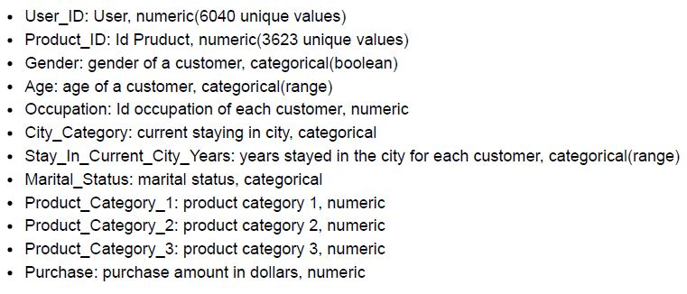
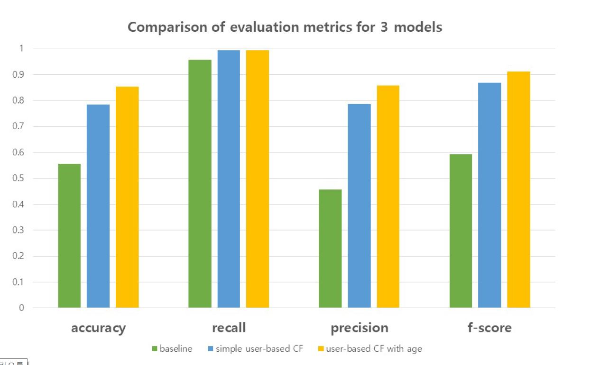

# Explore and Anaylze Black Friday Data & Build a Recommendation Model

Analyze the data using the dataset of shopping history on Black Friday. Build a recommendation system based on the result of the analysis.

### Data
- source: Kaggle
- url: [https://www.kaggle.com/mehdidag/black-friday](https://www.kaggle.com/mehdidag/black-friday)
 

 

### Explore and analyze data
- Deal with missing values and null values after investigating the distribution of the missing values.
- Check whether the data is appropriate for <b>memory-based-CF</b>
- Visualize the dataset and discover the important signals that might be used in the later steps.

 

### Correlation analysis
- Find out important relationships between features <b>using `pearson` and `spearman` method</b>
- Analyze correlation between `Purchase` and other features 
- Produce user data and analyze the correlation. Calculate the amound of purchase of each user and the number of products that each user bought.
- Analyze correlation between `Product_category` and other features

> We found that `Age` of each user was correlated to the user's preference of products. Therefore, `Age` can be used as a <b>metadata</b> to build the model of recommendation system. 

 

### Build Model
- Divide dataset into three parts : train, validation, and test data
#### <i>Baseline Model</i>
- Build a baseline model(Popularity Model) to compare with our model
- Implement a Cosine Similarity Function and compute similarity
 

#### <i>Collaborative Filtering Model</i>
- Build a <b>Collaborative Filtering Model - user based</b>
- Compute the similarity between users and build a recommendation matrix by selecting 5 similar users.

#### <i>Collaborative Filtering Model with Metadata</i>
- Build a CF Model - user based with <b>metadata, `Age`</b>
- Compute the similarity between users and select first 5 similar users who have the same age category.

#### <i>Evaluate Each Model</i>
- Model using `age` information is better than another

